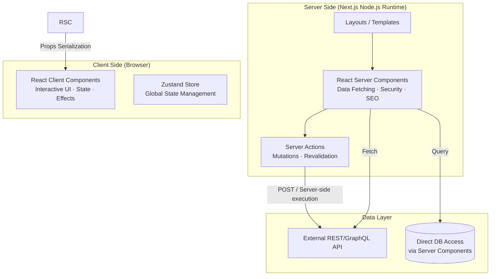
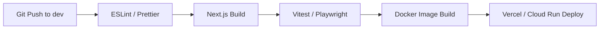

# ⚡ Next.js Enterprise Lab

> **"사용자 경험(UX)은 성능에서 시작되고, 코드 품질은 유지보수성에서 증명된다."**
> 
> 본 저장소는 대규모 엔터프라이즈 환경에서 Next.js 14(App Router)를 활용하여 최상의 성능과 확장성을 확보하기 위한 **프런트엔드 아키텍처 및 최적화 전략**을 연구합니다.

---

## 🏗 Architecture Overview

### Next.js App Router Architecture

Server Components(RSC)와 Client Components의 경계를 명확히 분리하여 런타임 자바스크립트 번들 크기를 최소화하고 데이터 페칭 효율을 극대화합니다.



---

## 🚀 Key Enterprise Strategies

### 1. Rendering & Data Fetching 전략

- **RSC (React Server Components)**: 모든 데이터 페칭은 기본적으로 서버에서 수행하여 폭포수(Waterfall) 현상 방지 및 보안 강화.
- **Streaming & Suspense**: 중요한 콘텐츠를 먼저 렌더링하고, 무거운 데이터는 레이아웃을 유지한 채 점진적으로 로딩(Skeleton UI).
- **Partial Prerendering (PPR)**: 정적 셸(Static Shell)과 동적 홀(Dynamic Hole)을 결합하여 응답 속도 최적화.

### 2. State Management (Zustand)

전역 상태를 최소화하고, 필요한 경우에만 **Zustand**를 활용하여 가볍고 직관적인 상태 관리를 구현합니다.

```typescript
// store/useUserStore.ts
import { create } from 'zustand';

interface UserState {
  user: User | null;
  setUser: (user: User) => void;
}

export const useUserStore = create<UserState>((set) => ({
  user: null,
  setUser: (user) => set({ user }),
}));
```

### 3. Performance Optimization

- **Image Optimization**: `next/image`를 통한 WebP 변환, Lazy Loading, Priority 설정.
- **Font Optimization**: `next/font`로 구글 폰트 자체 호스팅 및 레이아웃 시프트(CLS) 방지.
- **Bundle Analysis**: `next-bundle-analyzer`를 통해 중복 라이브러리 제거 및 Dynamic Import 적용.
- **Middleware**: Edge Runtime에서 인증 및 라우팅 처리를 수행하여 빠른 TTFB(Time to First Byte) 확보.

---

## 🔒 Security & SEO

- **Server Actions**: 브라우저에 노출되지 않는 서버 측 로직 실행으로 API 엔드포인트 숨김 및 데이터 검증.
- **CSP (Content Security Policy)**: 엄격한 보안 헤더 설정으로 XSS 방어.
- **Metadata API**: 동적 메타데이터 생성을 통해 각 페이지별 완벽한 SEO 최적화.
- **Middleware Guard**: JWT 검증 및 Role 기반 접근 제어(RBAC) 수행.

---

## 🧪 Testing Strategy

- **Unit Testing**: Vitest + React Testing Library (컴포넌트 로직 검증)
- **E2E Testing**: Playwright (실제 사용자 시나리오 및 브라우저 호환성 검증)
- **Visual Regression**: UI 변경점 자동 감지

---

## 🚀 CI/CD Pipeline



---

## 🛠 Tech Stack

| Category | Technologies |
|----------|-------------|
| **Core** | Next.js 14 (App Router), TypeScript |
| **Styling** | Tailwind CSS, Framer Motion (Animations) |
| **State** | Zustand, React Query (Server State) |
| **Testing** | Vitest, Playwright |
| **DevOps** | Docker, GitHub Actions, Vercel |
| **Icons** | Lucide React |

---

## 🌿 Branch Strategy

```
main   ─── 배포 가능한 안정 코드 (Production)
  └── dev ─── 개발 통합 브랜치 (Staging)
        ├── feat/server-actions-auth
        ├── feat/performance-skeleton
        └── docs/frontend-security-guide
```
